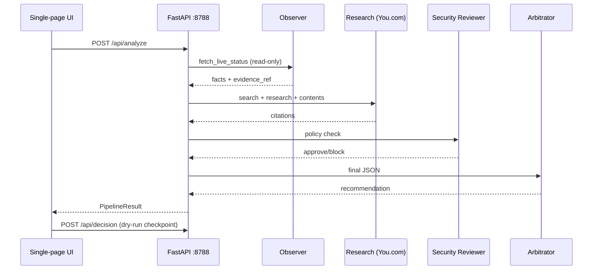

# Architecture — RalphiIA LiveOps Intelligence

## Flow

## Integrations

| Layer | Endpoint | Mode |
|-------|----------|------|
| RalfIA | `127.0.0.1:8101/status` | Read-only GET |
| You.com Search | `GET /v1/search` | Bearer `YOUCOM_API_KEY` |
| You.com Research | `POST /v1/research` | Bearer |
| You.com Contents | `POST /v1/contents` | Bearer |
| Fallback | fixtures in `youcom_client.py` | Labeled `fixture` |

## Safety

- No WhatsApp send, CRM, auth, or service restarts
- Approve button → audit checkpoint only (`executed: false`)
- UI sanitizes: no private IPs, Mongo URIs, or tokens in responses
